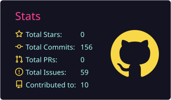
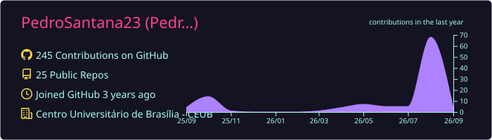

<h1 align="center">Olá! Eu sou o Pedro Henrique 👋</h1>

  Desenvolvedor Full-Stack e estudante de Ciência da Computação (CEUB). 

  
  
  

---

## 🚀 Sobre mim

- 🎓 Cursando Ciência da Computação no CEUB (conclusão em Dez/2026)
- 💼 Estagiário de TI no SERPRO, atuando com desenvolvimento web e automações
- 🔭 Buscando oportunidades como desenvolvedor júnior

---

## 🛠️ Tecnologias

### Back end

### Front end

---

## 📊 GitHub Stats

  
  

  

